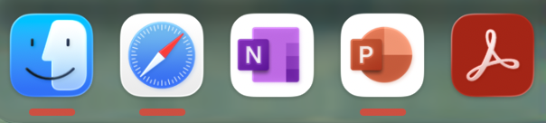

# DockMark

A tiny [Hammerspoon](https://www.hammerspoon.org/) script that draws a small red bar **under your macOS Dock icons — but only for apps that currently have a window** (open or minimized).

macOS shows a dot under every *running* app, even ones with no window. DockMark fixes that: **a running-but-windowless app gets no bar, and a closed app gets no bar: Only open apps with windows get a bar**.  The strips sit on your actual Dock (it is **not** a second dock), and they're click-through, so the Dock keeps working exactly as before.



## Features

- A thin red strip under a Dock icon **only** when that app has a real window.
- Minimized windows still count (configurable).
- Matches Dock icons to apps **by file path** (with name as a fallback), so apps whose Dock label differs from their internal name still work (e.g. Dock "Visual Studio Code" → app "Code").
- Lightweight: an app launch/quit watcher plus a once-per-second check limited to Dock apps. The overlay is only repainted when something actually changes.
- Click-through: the real Dock handles all clicks.
- Optional ignore list for apps that keep a phantom background window (e.g. Microsoft Teams).

## Requirements

- macOS (developed on macOS 26 "Tahoe", Apple Silicon; should work on recent versions).
- [Hammerspoon](https://www.hammerspoon.org/).
- Accessibility permission for Hammerspoon (it reads window lists and Dock geometry — it never captures screen contents, so no Screen Recording permission is needed).

## Installation (from the terminal)

### 1. Install Hammerspoon

```bash
brew install --cask hammerspoon
```

(Or download it from the [releases page](https://github.com/Hammerspoon/Hammerspoon/releases).)

Launch Hammerspoon once and grant it **Accessibility** permission when prompted
(System Settings → Privacy & Security → Accessibility). DockMark won't work without it.

### 2. Install the script

The commands below work **whether or not you already have a `~/.hammerspoon/init.lua`**. They install DockMark as a module and add a single `require` line to your config, creating `init.lua` if it doesn't exist and leaving any existing config untouched.

```bash
git clone https://github.com/jtorde/dockmark.git
cd dockmark

mkdir -p ~/.hammerspoon
cp dockmark.lua ~/.hammerspoon/dockmark.lua

# Add the loader line only if it isn't there already (creates init.lua if missing)
grep -qsF 'require("dockmark")' ~/.hammerspoon/init.lua \
  || echo 'require("dockmark")' >> ~/.hammerspoon/init.lua
```

### 3. Load it

Click the Hammerspoon menu-bar icon (the hammer) → **Reload Config**. Strips should appear under any Dock app that currently has a window.

### 4. (Recommended) Hide the native dots

So that only the red strips remain, turn off macOS's own indicators:
System Settings → Desktop & Dock → uncheck **"Show indicators for open applications."**

## Configuration

Open `~/.hammerspoon/dockmark.lua` and edit the `config` table near the top, then Reload Config.

| Option | Default | Description |
| --- | --- | --- |
| `stripColor` | red, `alpha = 0.95` | Bar color, as `{ red, green, blue, alpha }` (0–1). |
| `stripHeightPx` | `4` | Bar thickness in pixels. |
| `stripWidthFrac` | `0.42` | Bar width as a fraction of the icon width. |
| `cornerRadius` | `2` | Rounded ends of the bar. |
| `verticalNudge` | `0` | Fine-tune vertical position: positive moves bars **down**, negative **up**. |
| `includeMinimized` | `true` | If `true`, minimized windows still count. If `false`, a minimized-only app gets no bar. |
| `refreshInterval` | `1.0` | Seconds between background checks. Raise it for slightly less CPU; lower it for faster updates. |
| `ignoreApps` | `{}` | Lowercase app names that should **never** get a bar (e.g. `"microsoft teams"`). |
| `debug` | `false` | If `true`, logs the current bar set to the Hammerspoon Console whenever it changes. |

## Diagnostics

If a bar is missing or stuck, reproduce the problem, then open the Hammerspoon Console (menu-bar hammer → Console) and run:

```lua
DockMark.dump()
```

It prints every Dock item (with its resolved path), every matching running app with its window list and window subroles, and which icons would get a bar. That output makes it easy to see whether the cause is a name/path mismatch, a window-subrole quirk, or an app reporting a window you thought was closed.

## Known limitations

- **Dock magnification:** works best with magnification **off**. With it on, icons grow and shift on hover and the strips won't follow the zoom.
- **Auto-hide Dock:** a hidden/sliding Dock isn't tracked live.
- **Mission Control Spaces:** macOS can't reliably report windows on a Space you haven't visited this session, so an app whose only window lives on another Space may not get a bar until you switch there once.
- **Phantom-window apps:** some apps (e.g. Microsoft Teams) keep a background window alive after you "close" it, so they honestly report a window. Add them to `ignoreApps` if that bothers you.
- **Update latency:** changes inside an already-running app (opening/closing a window) are caught by the periodic check, so they can take up to `refreshInterval` seconds to reflect.

## Uninstall

```bash
rm ~/.hammerspoon/dockmark.lua
# remove the loader line from init.lua (macOS sed needs the empty '' argument)
sed -i '' '/require("dockmark")/d' ~/.hammerspoon/init.lua
```

Then Reload Config. (If you installed it *as* `init.lua` instead, just remove or replace that file.)

## How it works

DockMark reads your Dock's layout through the macOS Accessibility API to find each application icon's on-screen frame. For each Dock app it checks the app's live window list for a genuine standard window (honoring `includeMinimized`), and paints a thin overlay strip beneath the icons that qualify. The overlay is a draw-only, click-through `hs.canvas` placed just above the Dock's window level, so your Dock keeps behaving normally.

## License

MIT — see [`LICENSE`](LICENSE). <!-- Add a LICENSE file, or change this line to whatever you prefer. -->
